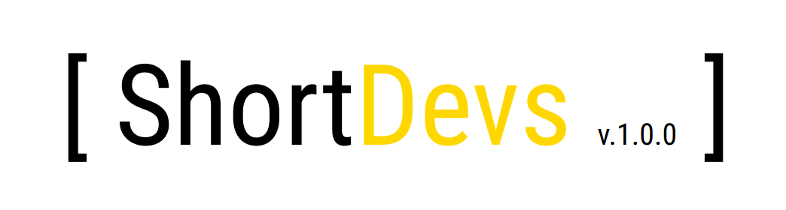

# ShortDevs

Video Demo: https://www.youtube.com/watch?v=GrgkIp0M_0Q

Shortdevs is a tool created with html / css / php / mysql / js and jquery.

Shordevs allows the user to collect, manipulate, share data on the web and it simplifies work.

Shortdevs allows a non-programmer to create anything that he can imagine with the help of shortcodes and tables.

In Shortdevs a table is called a "page" or "superpage".

Pages are private, only the json data for the pages can be shared on the web.

Superpages can be shared public or stay private,and they can be catalogs, websites,business cards,web pages, forms, charts, inventories,newspapers, games, CADs, electronic circuits, directories or anything that the user will create.

Programmers / Developers can create an unknown number of shortcodes for the users of Shortdevs.

A shortcode can be anything that a programmer can imagine. ( A calculator, a shortcode to solve a math problem, a convertor, something that parses data, a form that collects data for the user on a superpage, a chart, a html element etc.)

Shortdevs is the universe of shortcodes and tables.

Special Edit SuperPage Shortcode : [Page Name][{][(][Page Name][Page Name[)][(][Page Name][Page Name][)][}]
It creates line 57 row
[img]https://i.ibb.co/NrBnZw7/Screenshot-from-2020-07-19-12-45-08.png[/img]

"(" = "<table><tr>"
")" = "</tr></table>"
"{" = "<td>"
"}" = "</td>"

Create your own cool rows ... 

-------------------------------

If you need shortcodes or templates/designs development , or if you want to invest ,sponsor or contribute to the project

#### You can contact me on telegram @Alin100 or  email wdesigner2010[dot]gmail.com

